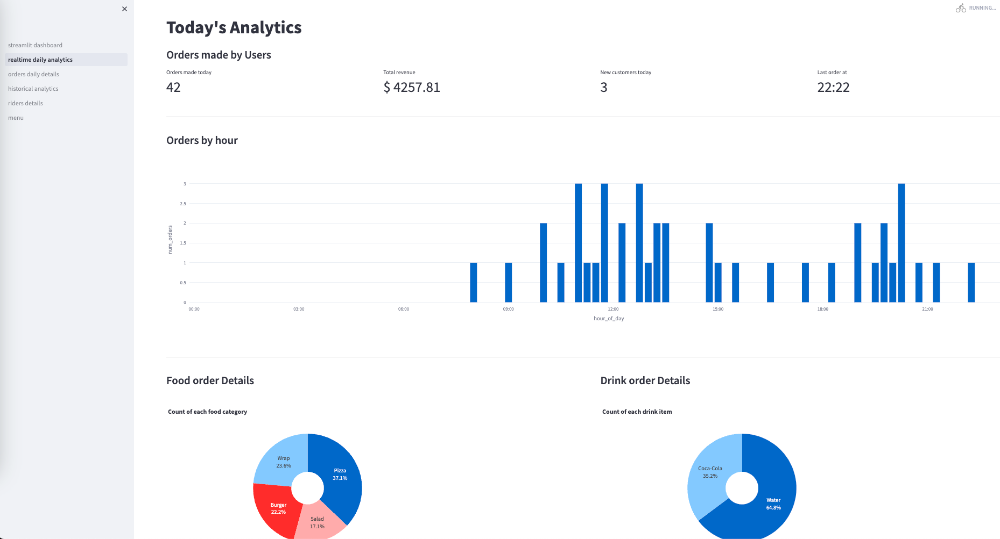
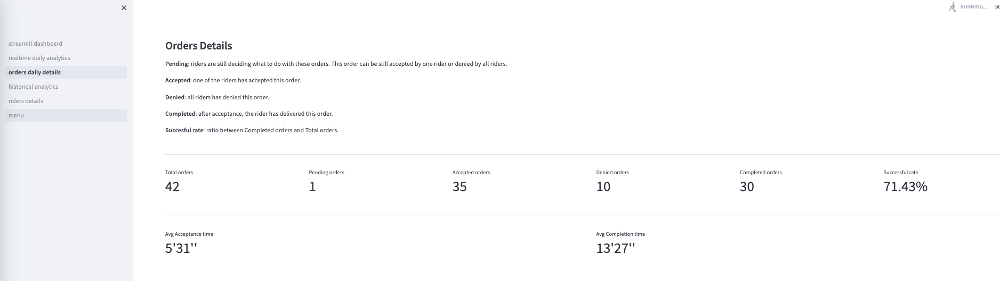
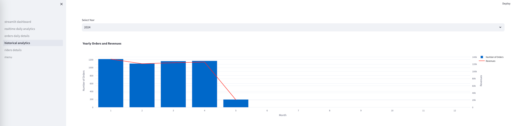
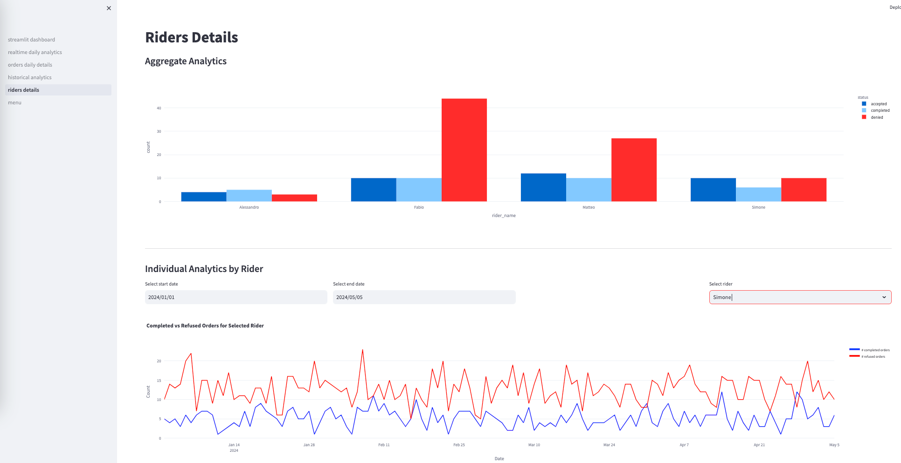
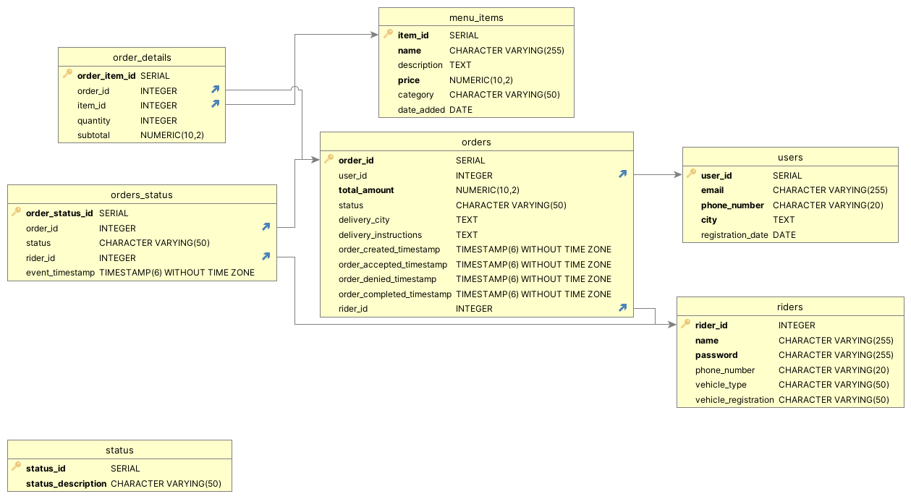

# Repo Introduction

This is my first "big" Data-Engineering project, and it's all about simulating a Food-Ordering App. It all started when I found a cool tutorial on YouTube by "Code with Irtiza" ([link here](https://www.youtube.com/watch?v=qi7uR3ItaOY&ab_channel=CodewithIrtiza)). That tutorial tries to explain how to use Apache Kafka for a simple project. I created a new project ([link here](https://github.com/simdangelo/food-ordering-app-spark-kafka)) starting by that tutorial and I also add new features and functionalities like Spark, Cassandra DB, a frontend section and so on. But, I quickly realized that , as a beginner, diving straight into Spark, Cassandra, and Kafka might be not the best solution for me. Focusing on fundamentals like Databases, Request-Response Architecture, and in general getting familiar with coding was a much better way to start with. So, I decided to take a step back and to create this new repository.

# Project Details
This is a project is split into four main parts:
1. **Order Placement**: Users can place orders through a simple frontend section that communicates with the backend via Flask. Once placed, these orders are dispatched to available riders who can either accept or decline them.
2. **Rider Interaction**: Orders from users are sent to a Kafka topic accessible from each rider's smartphone (simulated through a terminal). Each rider can then decide whether to accept or refuse an order. If one rider accepts, the order becomes unavailable to others; if all riders refuse, the order is marked as "failed".
3. **Order Completion**: Riders have access to a private area displaying all accepted orders. After delivering an order, a rider can mark it as "completed".
4. **Analytics Dashboard**: Shop owners can access a dashboard (built with Streamlit) providing insights into the order flow and other relevant analytics.

Now, I'll try to explain each of these sections.

## Make Orders
Users can easily place orders through a user-friendly frontend that interacts with the backend via Flask. Here's a glimpse:


## Rider Interaction
Orders are dispatched to riders' smartphones (simulated through terminals) via Kafka. Each rider can then accept or reject incoming orders:


## Order Completion
Riders can manage their accepted orders in a private area. After delivering an order, they can mark it as "completed":

*Yeah, `Order Completion Timestamp` is not properly populated. I'll fix as soon as possible.*

## Analytics Dashboard
Shop owners have access to a dashboard (powered by Streamlit) offering insights into various aspects of the order process:





# Technical Details
* **Database**: PostgreSQL, containerized with Docker.
* **Backend-Frontend** Communication: Flask.
* **Order Dispatch**: Kafka, containerized with Docker.
* **Dashboard Creation**: Streamlit.
* **Frontend Enhancements**: JavaScript (thanks to ChatGPT).

# Relational Schema
Here's the schema representing the database structure:

*Yeah, `status* is an old

# Getting Started
This project is tested on macOS Sonoma 14.3.1 and Python 3.10.

Here's how to get started:
1. Clone this repository:
```
git@github.com:simdangelo/food-ordering-app-v2.git
```
2. Create a virtual environment and install the requirements with `requirements.txt` file:
```
pip install -r requirements.txt
```
3. Navigate to the project directory and fire up the Docker containers defined in `docker-compose.yml` file (install Docker if you don't have it yet):
```
docker-compose up
```
4. Wait for the containers to be up and running. Then open a terminal to run the Flask app:
```
python routes.py
```
Then open three terminals to simulate three riders:
```
python consumer1.py
python consumer2.py
python consumer3.py
```
Finally, launch the Streamlit dashboard:
```
streamlit run streamlit_dashboard.py
```
Additionally, I've provided a Python script to populate the database with some fake data for visualizing the dashboard, even for past years:
```
python populate_db.py
```

# Ongoing Improvements
I'm aware that there are several areas that need fixing and enhancement (even in the images I posted here you can see some visualization bugs, but from the DB point of view all should work correctly). From improving frontend readability to increasing efficiency and removing redundancies, there's a lot on the to-do list.