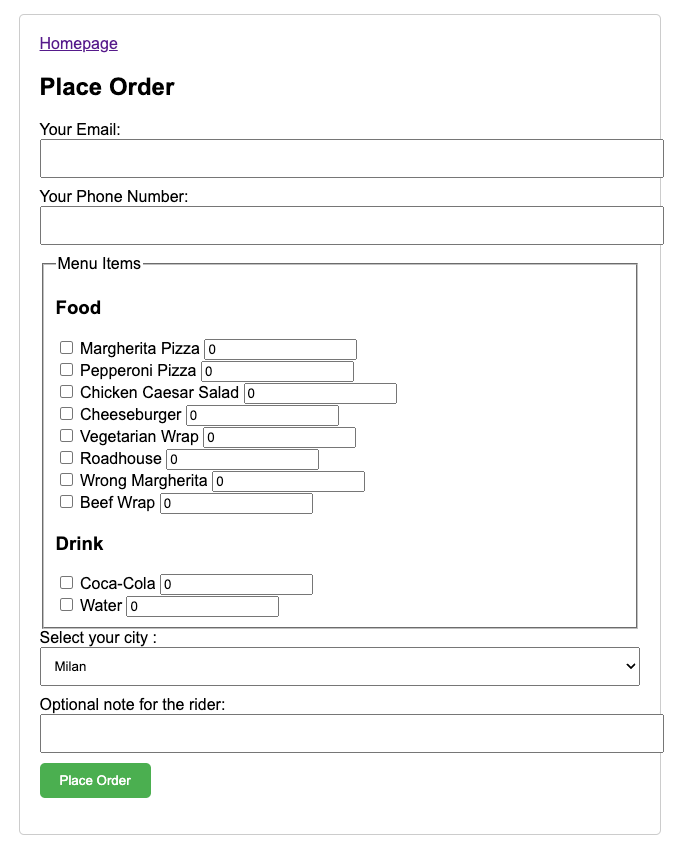

# Repo Introduction
This repo is my attempt to recreate a project I found on YouTube ([link here](https://www.youtube.com/watch?v=qi7uR3ItaOY&ab_channel=CodewithIrtiza)) by "Code with Irtiza" that explains how to use Apache Kafka for a simple project. My plan is to start by copying that project and then add more features, like a database, to make the application do more things.


**Update1 - 2024-03-16**. I added some features to make the project more interesting and challenging with respect to the original one:
* add a frontend section where users can make orders;
* add a frontend section where shop workers can see the orders and can notify users when the order is ready;
* add Flask module to create APIs for the frontend to communicate with the backend.
* add Apache Spark to process the data coming from the frontend through Kafka;
* add a Cassandra database to store the orders.

**Update2 - 2024-04-03**. I made some changes to the project, and so this README file is not updated yet. I will update it as soon as possible.

# Project Details
This is a project about how to build a scalable and decoupled backend for an application using Apache Kafka and Python. It's not really matter what this app is (a food ordering app in this case), but it's more about the system that we want to build and how it can scale very easily.

I will build the whole system locally using a locally running Kafka broker, but of course in a production setting you will want to run multiple Kafka instances in a more mature environment.

# Application System Diagram

**This image represents the original project. Now it is more complex, but the image is not updated yet.*
# Getting Started
This project is tested on MacOS Sonoma 14.3.1 and Python 3.10. You probably need to install Java on your machine as well. My version is Java 17.0.8.
1. Clone this repository:
```
https://github.com/simdangelo/food-ordering-app.git
```
2. Create a virtual environment and install the requirements with `requirements.txt` file:
```
pip install -r requirements.txt
```
3. Navigate to the project directory and spin up the Docker containers through `docker-compose.yml` file (install Docker if you don't have it yet):
```
docker-compose up
```
4. Wait for the containers to be up and running. Then open a terminal to run the Flask app:
```
python routes.py
```
Then open another terminal to see realtime analytics about orders and revenues:
```
python analytics.py
```
Now start the Spark Application with:
```
python db-ingestion.py
```

# Results


As you can see in the image above:
* the Flask app is running (bottom right terminal);
* a frontend section where user can make customized orders (upper left window);
* as soon as the user make an order, that order appear in the analytics terminal (bottom left terminal) and stats about the numbers of orders and the revenue in that day are updated;
* the shop workers can see pending orders corresponding to the green button (upper right window). As soon as an order is ready, shop workers click the green button that becomes immediately red and the analytics terminal is updated with the completion of the order and stats about the number of orders still active is updated.

Of course all the orders are stored in Cassandra DB:


# Bugs
After the first order, in the analytics terminal the stats about the number of orders and the revenue remain 0, maybe because data is not stored yet in the Cassandra DB and so the application didn't see any records in the DB.
